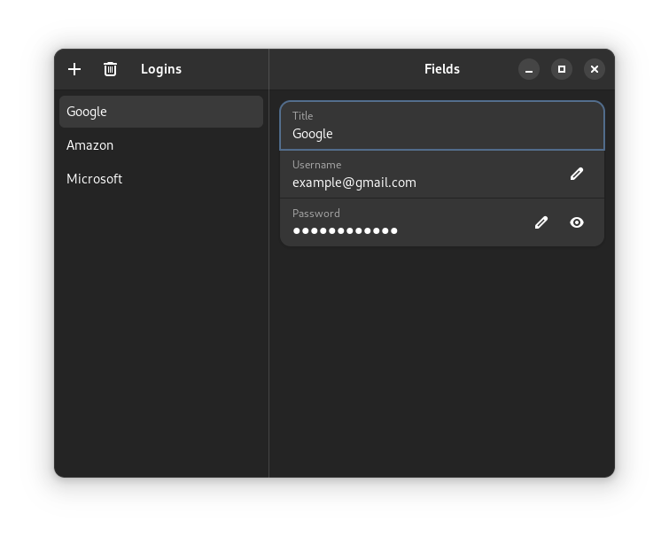
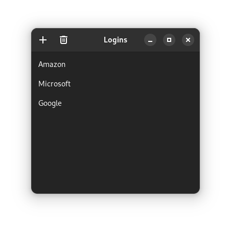
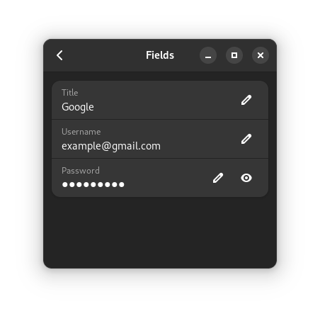
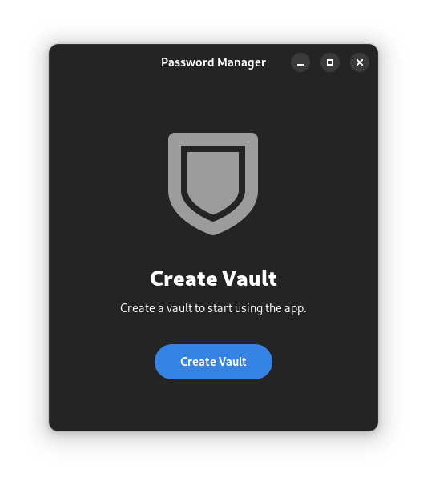
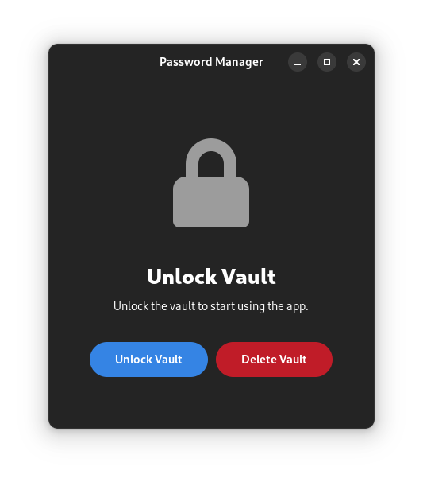
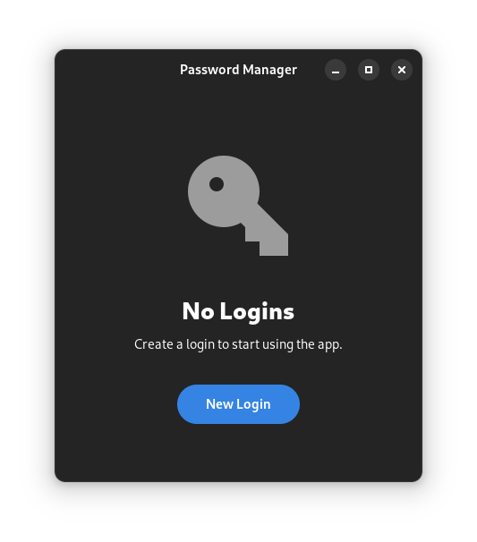

# Pass
A linux password manager written in Rust using GTK4 and Libadwaita.

## Building (Linux, MacOS)
Tested on Linux and MacOS. 
Windows / WSL2 may work but is untested.

### Install Nix
Install Nix using the [Determinate Installer](https://github.com/DeterminateSystems/nix-installer) using the command below.
```bash
curl --proto '=https' --tlsv1.2 -sSf -L https://install.determinate.systems/nix | sh -s -- install
```
Alternatively you can install Nix from the [official website](https://nixos.org/download.html) and enable [nix-command and flakes](https://nixos.wiki/wiki/Flakes) manually.

### Building with Nix
Clone and enter the repo then use `nix develop` to enter an environment with all the required dependencies.
```bash
git clone https://github.com/justryanw/pass
cd pass
nix develop --command cargo run --release
```

### Building without Nix
Ensure you have [Rust](https://www.rust-lang.org/tools/install), [pkg-config](https://www.freedesktop.org/wiki/Software/pkg-config/), and the dependencies for [GTK4](https://gtk-rs.org/gtk4-rs/git/book/installation_linux.html) and [Libadwaita](https://gtk-rs.org/gtk4-rs/git/book/libadwaita.html#linux) installed on you system.
```bash
git clone https://github.com/justryanw/pass
cd pass
cargo run --release
```

## Screenshots

### Main Page
The main page is shows a sidebar and the main content.



### Limited Width
With a smaller window the page folds to only show the sidebar, clicking on an item brings you to its content with a back button to return.




### Placeholder Pages
Placeholder pages guide the user in initial setup.



